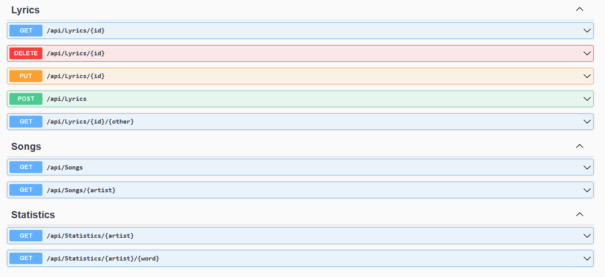

# Lyrics API
Web REST API providing song lyrics for 11 artists.
Were implemented CRUD operations and statistics endpoints.
Data was taken from https://www.kaggle.com/datasets/ceebloop/rap-lyrics-for-nlp.

## Used technologies
- ASP.NET Core Web API
- EntityFramework Core (PostgreSQL)
- MediatR
- FluentValidation
- MemoryCaching

## Available endpoints

